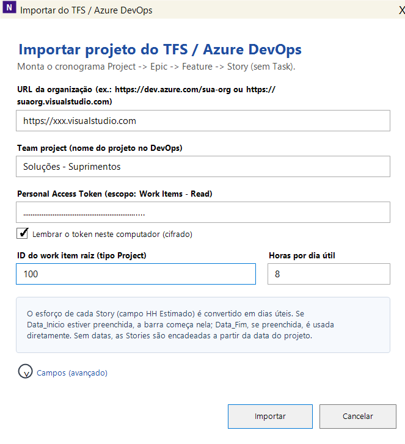

🌐 [Leia em Português](README.pt-BR.md) | **English**

---

# NXProject Community

**Management visibility over Azure DevOps — without changing anything in the technical team's workflow.**

NXProject lets Tech Leads, Scrum Masters, Project Managers, and Business Stakeholders see the real project picture straight from Azure DevOps: schedule, dependencies, resource allocation, and Gantt chart — in a free Windows desktop application.

The development team keeps working in Azure DevOps exactly as before: code traceability, pull requests, pipelines, and delivery quality remain untouched. NXProject reads that data and turns the backlog into a planning view that managers and leads can actually use to make decisions.

---

## The problem NXProject solves

IT projects using Azure DevOps have an organized backlog, defined sprints, and updated work items — but **management has no integrated schedule view**. Simple questions go unanswered:

- When will this Feature be done, considering all its Stories?
- Which resource is overloaded next month?
- If this Story slips, what else gets impacted?
- Is the project going to deliver on time?

NXProject imports the Azure DevOps hierarchy and turns that data into a manageable schedule, with Gantt, dependencies, allocation, and delay alerts — **without requiring the technical team to change anything in their process**.

---

## Every role sees what they need, without friction

The development team keeps using Azure DevOps as the single source of truth: linked commits, code review, pipeline automation, and full traceability remain intact. NXProject is a **read-and-planning layer** on top of that data, aimed at those who need to answer questions about deadlines, capacity, and risk.

---

## The story behind NXProject

NXProject wasn't born as a product. It was born to solve a real problem.

At the time, my wife was pursuing a Master's degree in Education Management and needed to build a project schedule for a school ramp renovation. The need seemed simple: organize tasks, dependencies, and track the plan visually.

We looked for free tools, but the open-source options we found were outdated, and commercial alternatives required licenses I didn't have at that moment — I was between jobs.

So one weekend, I decided to build a simple alternative to turn tasks into a visual schedule and make it easier to track the project.

The initial goal was just to solve that one problem.

But as I built it, I realized the challenge was much bigger.

After more than 20 years working in technical leadership in data and software engineering, I kept seeing the same conflict in technology projects: technical tools worked great for development and data engineering teams, while management tools delivered schedules and reports — but often at the cost of parallel processes, rework, and lost traceability.

Technical teams needed to keep working in their day-to-day tools.

Managers needed to understand deadlines, capacity, dependencies, and risks.

Usually, someone had to give something up.

That's when the project stopped being just a schedule generator and evolved into NXProject.

Months later, as the idea matured and AI-assisted development tools advanced — after going deeper into environments like Codex and Claude Code — the product evolved quickly. What started as a simple prototype gained new capabilities in planning, visualization, and integration, allowing me to accelerate the vision that had existed from the beginning.

Later, when I integrated with Azure DevOps, I realized the same concept also helped real software and data engineering teams: teams kept working in their established flow — backlog, code, pipelines, automations, and traceability — while leaders and managers finally gained an integrated view of schedule, dependencies, capacity, and impact.

Today NXProject turns Azure DevOps data into a management view of planning and execution, allowing the technical and the managerial to work together — without friction, without parallel processes, and without giving up traceability.

---

## Download

**First time installing?** Download and run the Setup — it installs the .NET runtime, third-party libraries and a Desktop shortcut, then automatically fetches the latest NXProject version:

- [Download NXProject-Setup.zip](../../releases/download/nxsetup-latest/NXProject-Setup.zip)

  The Setup lives in its own fixed release, [`nxsetup-latest`](../../releases/tag/nxsetup-latest), and is republished only when the installer base itself changes — not on every NXProject version.

**Already installed?** Just grab the small update package and extract it over your existing installation:

- [Download NXProject.Community-Release.zip (update)](../../releases/latest/download/NXProject.Community-Release.zip)
- [View release notes and source code downloads](../../releases/latest)

> `NXProject.Community-Release.zip` alone does **not** include the .NET runtime or third-party libraries (PdfSharp, WebView2, CommunityToolkit.Mvvm, LLamaSharp) — it only contains the app files (`.exe`/`.dll`) that change every release, and must be extracted **on top of** an existing installation (created by NXProject-Setup or a previous full release). Use NXProject-Setup.zip for a first-time install on a new machine.
>
> **Third-party licenses**: the distribution includes open-source libraries (mostly under the MIT license). Copyright notices and license texts are in [`THIRD-PARTY-NOTICES.txt`](THIRD-PARTY-NOTICES.txt), also shipped inside the zips.
>
> **About Local AI**: besides NXProject's compiled code, the distribution includes `LLamaSharp.dll`, which is **just an open-source .NET wrapper (MIT license)** for llama.cpp — by itself it does not run any model. The native engine (`llama.dll`) and the GGUF model are **not** shipped in the Setup: they are optionally downloaded by NXProject itself (AI menu → Manage Local AI) into a user-chosen folder, with validation and auditable code ([LLamaSharp](https://github.com/SciSharp/LLamaSharp) / [llama.cpp](https://github.com/ggml-org/llama.cpp)).
>
> The binaries were built in an environment with McAfee antivirus. If you prefer to build from source, see the instructions below.

---

## If Windows blocks the .exe

Windows may refuse to run `NXProject.Community.exe` with a "Windows protected your PC" SmartScreen dialog, or simply do nothing when you double-click it. This happens because the binary is unsigned and was downloaded from the internet.

### Option 1 — Unblock via Properties (simplest, no admin required)

1. Right-click `NXProject.Community.exe` → **Properties**
2. At the bottom of the **General** tab, check **Unblock**
3. Click **OK** and double-click the `.exe` again

If the checkbox is not there, the file was already unblocked (or your system uses a stricter policy — see options below).

### Option 2 — Sign with a local developer certificate (recommended for organizations)

Run the script below **as Administrator** once. It creates a self-signed code-signing certificate, installs it as a trusted publisher on the machine, and signs all `.exe`/`.dll` files in the build output:

```powershell
# Run as Administrator in the project root
.\sign-nxproject.ps1
```

After that, run normally with `.\run-community.ps1` or double-click the `.exe`. **No parameter is needed** — the certificate is installed in the machine store and Windows picks it up automatically.

> The certificate is valid for 10 years and covers all future builds as long as you re-run `sign-nxproject.ps1` after each new release.

### Option 3 — WDAC supplemental policy (for corporate environments with strict execution policy)

If your organization enforces Windows Defender Application Control (WDAC) and neither option above works, run the WDAC script as Administrator to allow the NXProject folder:

```powershell
# Run as Administrator
.\allow-nxproject-wdac.ps1
```

This creates a supplemental WDAC policy that allows executables from the NXProject folder. A reboot may be required.

> This option is only needed in tightly locked corporate environments. Most users only need Option 1 or 2.

---

## Screenshots


> The two images above are conceptual illustrations with fictional data, not screenshots.




> These application screenshots were captured with the Portuguese UI; the product itself is bilingual and switches to English automatically.

---

## Who is NXProject for

| Role | What NXProject delivers |
|---|---|
| **Project Manager** | Schedule integrated with the backlog, delay alerts, dependency view |
| **Scrum Master / RTE** | Capacity per sprint, allocation conflicts, impact of date changes |
| **Tech Lead** | Features and Stories with predecessors and hour-based estimates |
| **PMO** | Multi-project consolidation, export to MS Project / Excel |

---

## Azure DevOps Integration

### From backlog to schedule in minutes

NXProject imports the full hierarchy of your project directly from Azure DevOps:

```
Project → Epic → Feature → Story
```

Each Story becomes a schedule row with start date, working-day duration, assignee, and sprint — all extracted from the fields your team already fills in DevOps.

### Planning philosophy: degrees of freedom

By default NXProject plans down to the Story level. Tasks can also be pulled into the schedule through the button that loads them from DevOps (**Load Task ToDo**), but the intent is different: Developers detail and create the tasks during execution, supported by the **TaskBoard** — which brings more agility to the project.

Inspired by the mathematical concept of **degrees of freedom** — used to model complex systems — NXProject applies the same principle to planning: it structures the complexity of technology without constraining the development process. Just as degrees of freedom define the space of possible movement in a physical system, NXProject defines the boundaries (dates, resources, dependencies) and preserves the space the technical team needs to navigate autonomously within them.

### TaskBoard: where execution happens

The schedule answers "when"; the **TaskBoard** shows "who is doing what, right now". It reads the sprint Tasks straight from Azure DevOps and lays them out in columns by state (New, Active, Resolved, Closed), in two views:

- **Project & Story** — Stories in the state columns, grouped by Project, EPIC and Feature. The manager's tracking view.
- **Person & Task** — one band per person and, inside it, one row per Story with the Tasks spread across the columns (the illustration above). The team's day-to-day view.

Beyond listing, the board lets you:

- **Drag a Task across columns to change its state**; nothing goes to DevOps right away — changes are queued and written in a single batch through the **Update TFS** button, with a report of what changed.
- **Doing / Done**: marks for what a person is working on now and for what is finished but not yet closed in DevOps (they become work item tags).
- **WIP limit per person** (not per project): the board counts each person's Tasks in progress and flags whoever went over the limit.
- **Inconsistent state alert**: the Story is highlighted when its state does not follow the Tasks — a Story in New with a Task already started, or a Story in Active with no Task in Active.
- **Blocking (`BLOCK` tag)**, sprint, assignee, priority, estimated/completed hours and description, all editable from the card.
- **Filters** by person, Story, state and sprint (one or many), plus slices such as "blocked only", "Active tasks only" and "schedule stories only".

The TaskBoard is where the degree of freedom described above becomes concrete: planning delivers the Story, and the team creates and drives the Tasks from there.

### DevOps Project List

Manage multiple DevOps projects in a shared file across your team. Each project has a name and root ID; to import, just pick the project from the list — no need to remember the ID manually.

### What is read automatically

- **Hierarchy**: `Project → Epic → Feature → Story` via `Child` links
- **Estimates**: custom `HH Estimado` field → duration in working days on the project calendar
- **Dates**: `Data_Inicio` and `Data_Fim` when already set in DevOps
- **Assignee**: `System.AssignedTo` → project resource
- **Sprint**: `System.IterationPath` → sprint association in NXProject
- **Backlog order**: `Microsoft.VSTS.Common.StackRank`
- **Blockers**: child Tasks with the `Block` tag mark the Story as blocked
- **State**: `Closed`/`Resolved` Stories with open child Tasks are flagged and auto-corrected
- **Allocation %**: `Perc_Alocacao` — how much of the person's day is dedicated to this Story (affects finish date)
- **Sync version**: `Sync_version` and `Sync_Name` — concurrency control (see below)

> Field names can be changed in the **Advanced fields** section of the import dialog if your process uses different names.

---

### Root work item and hierarchy (`Project` type)

NXProject builds the schedule on the **Project → Epic → Feature → Story → Task** hierarchy.

> ⚠️ **`Project` is NOT a standard Azure DevOps work item type** (the standard tops out at Epic). It's a **custom** type that acts as a "container" above Epics, grouping the whole project. Many organizations create this type in their process.

How the root is used:

- **Manual import:** you enter the **root work item ID** in the import screen; NXProject imports the descendants (Epic → Feature → Story → Task). The root type does **not** have to be exactly `Project` — it can be any work item that is the parent of the Epics (even an Epic, if you only want to import that one).
- **Discovery** (Portfolio → Discovery DevOps): automatically lists work items **of type `Project`** with no parent in the Team Project. For automatic Discovery to work, the custom `Project` type must exist.

If your organization doesn't use a `Project` type, you can still import by pointing the root ID at an Epic (or other container) — only automatic Discovery depends on the `Project` type.

> **Fields on the `Project` type:** since it sits at the top of the hierarchy, create the **same custom fields on it as on the Epic** (`Estimated HH`, `Data_Inicio`, `Data_Fim`, `Sync_version`, `Sync_Name`). In practice the `Project` type is usually a copy of the Epic. NXProject reads the project start date (`Data_Inicio`) directly from the root item.

---

### Required custom fields (Story, Feature and Epic)

NXProject reads and writes custom fields on **Stories, Features and Epics** in Azure DevOps. You must create them in your process template under **Organization Settings → Process → [Your Process]** and add them to each work item type you want to sync (Story, Feature, Epic).

| Field name (display) | Reference name | Type | Default in NXProject | Used on | Purpose |
|---|---|---|---|---|---|
| `HH Estimado` | `Custom.HHEstimado` *(example)* | Integer or Decimal | `HH Estimado` | Story, Feature, Epic | Estimated effort in hours |
| `Data_Inicio` | `Custom.DataInicio` *(example)* | Date/Time | `Data_Inicio` | Story, Feature, Epic | Planned start date |
| `Data_Fim` | `Custom.DataFim` *(example)* | Date/Time | `Data_Fim` | Story, Feature, Epic | Planned finish date |
| `Perc_Alocacao` | `Custom.PercAlocacao` *(example)* | Decimal/Float (1–100, up to 2 decimals) | `Perc_Alocacao` | Story | % of person's day dedicated to this Story |
| `Perc_Conclusao` | `Custom.PercConclusao` *(example)* | Integer (0–100) | `Perc_Conclusao` | Story | % completion (read on import, written on sync) |
| `EPIC_TYPE` | `Custom.EPIC_TYPE` *(example)* | Text (list: `DELIVERY` / `BACKLOG`) | `EPIC_TYPE` | Epic | Classifies the Epic: **Delivery** (adds hours to the project total) or **Backlog** (does not). Enabled by default. |
| `Tipo_Centro_Custo` | `Custom.Tipo_Centro_Custo` *(example)* | Text (`OPEX` / `CAPEX`) | `Tipo_Centro_Custo` | Epic | Cost-center type — used by the **Projects Portfolio** (OPEX/CAPEX) |
| `Sync_version` | `Custom.Syncversion` *(example)* | Integer | `Sync_version` | Story, Feature, Epic | Concurrency version counter (auto-managed) |
| `Sync_Name` | `Custom.SyncName` *(example)* | Text *(plain text, not Identity)* | `Sync_Name` | Story, Feature, Epic | Who last synced (auto-managed) |
| `Adm_NX` | `Custom.Adm_NX` *(example)* | Identity (points to a DevOps group/Team) | `Adm_NX` | Project (root item) | NX admin group: **only members of this group can Export/Sync** to DevOps. Empty/missing = open to everyone. Enabled by default. |

> **Optional HH fields (advanced).** Besides `HH Estimado`, NXProject recognizes separate hour fields when they exist, to preserve the plan on 100%-complete items: `HH Original` (`HH_Original_float`), `HH Restante` (`HH_Restante_float`) and `HH Atual` (`HH_Atual_float`) — on Story, Feature and Epic. If absent, NXProject derives the values from `HH Estimado`/state.

> The reference names above are examples — Azure DevOps generates them automatically from the display name and your organization prefix.  
> If your fields have different display names, set them in NXProject under **Configure Azure DevOps → Advanced fields**, where all field names are configurable: HH Estimado, Data_Inicio, Data_Fim, Perc_Alocacao, Perc_Conclusao, EPIC_TYPE, Tipo_Centro_Custo, Sync_version, Sync_Name, Adm_NX and block_duration_hours.

> **Don't want to guess the names? Use "Detect DevOps fields".** At the end of **Advanced fields** there is a button that asks DevOps which of the names you typed actually exist, **in which work item types** (Task, User Story, Feature, Epic, Project) and with which data type. It also reports when a name was matched by an **alternative name** — NXProject accepts a few per field, so `HH Estimado` still works when the field is really called `Esforço Estimado` — and it ticks or unticks the optional-feature checkboxes according to what it found. Nothing is written to DevOps and nothing is saved until you press **Save**; **Cancel** undoes it.
>
> Detection only answers whether the field exists and where. Process rules, write permission and incompatible data types only surface when NXProject actually writes — if an import or sync fails for that reason, the error message names the field.

> **Admin group (`Adm_NX`) — who can sync.** On the root (`Project`) work item, create an **Identity** field named `Adm_NX` and point it to a DevOps **group/Team**. Only the **members of that group** can Export/Sync to DevOps from the imported schedule; local editing and Task Plan stay free for everyone. The group is shown in the banner and in the **Project Portfolio** editor. Who may sync is validated **live** at Sync time — NXProject **re-reads the `Adm_NX` field straight from the `Project` work item in DevOps** and compares it to the authenticated user (the PAT owner), without relying on the config checkbox or on what was cached in the `.nxp`; so turning the option off after import does **not** turn the gate off. Empty/missing field on the `Project` work item = **open to everyone**. It replaces the old Portfolio "Read-only" flag. Configurable (enable/name) under **Advanced fields**.
>
> **Important:** after creating the `Adm_NX` field in the process *template*, you must **open each `Project` work item, pick the group and Save**. Until the value is persisted on the item, the field is empty in the API — even if it shows in the form — and NXProject reads it as "open to everyone".

> **Backlog order (StackRank / BacklogPriority):** NXProject writes the backlog order to the process's standard field — `Microsoft.VSTS.Common.StackRank` on **Agile/CMMI/Basic** and `Microsoft.VSTS.Common.BacklogPriority` on **Scrum**. These fields already exist in the process (no need to create them). The Team Project process is read automatically on import/discovery and shown in the banner and the Portfolio editor.

> **Tip:** create the fields once at the process level and then add them to Story, Feature and Epic work item types — they share the same field definition across types.

#### Task fields (no custom fields required)

The **Task** uses only **standard** Azure DevOps fields, which already exist on the Task type — you do **not** need to create any custom field:

| NXProject concept | Standard field (reference) | Note |
|---|---|---|
| Estimated HH | `Microsoft.VSTS.Scheduling.OriginalEstimate` | Task estimated effort |
| Current HH | `Microsoft.VSTS.Scheduling.CompletedWork` | Completed work |
| Priority | `Microsoft.VSTS.Common.Priority` | The stock DevOps form uses 1–4; in NXProject the range is configurable (default 1–9) |
| Backlog order | `Microsoft.VSTS.Common.StackRank` / `BacklogPriority` | Process's standard field (no need to create) |
| Assigned To / State / Activity | `System.AssignedTo` / `System.State` / `Microsoft.VSTS.Common.Activity` | — |

> **`Approved` field (optional, Task only).** If your process has a boolean `Approved` field (`Custom.Approved`) on the Task, NXProject reads and writes the Task approval. Enabled by default; ignored if the Task lacks the field. Configurable under **Advanced fields**.

> **`block_duration_hours` field (optional, Task).** A numeric field that stores **how many hours the
> item was impeded** (blocked with the BLOCK tag), always in whole hours — under one hour becomes `0`.
> NXProject recalculates the total from the DevOps history when you unblock, and the Task card shows a
> ⏱ shortcut to the **BLOCK audit** when the value is greater than zero.
> **Disabled by default and entirely optional**: leave the checkbox off — under **Advanced fields** —
> and NXProject never writes to it. Blocking keeps working with the tag plus a comment, and the BLOCK
> audit (right-click on a Story or Task card) still reads the full history online, with or without this
> field. Nothing in the process template is required.

> Dates, `Perc_Alocacao`, `EPIC_TYPE`, `Tipo_Centro_Custo` and `Sync_version`/`Sync_Name` do **not** apply to Tasks — planning (dates and duration) is derived from the parent Story.

#### Concurrency control (`Sync_version` / `Sync_Name`)

When two users sync changes simultaneously, the last write could overwrite the first. NXProject prevents this with the `Sync_version` / `Sync_Name` pair, which must be present on every work item type you sync (Story, Feature, Epic):

- On every sync that writes at least one change, `Sync_version` is incremented by 1 and `Sync_Name` is set to the current Windows user.
- When you sync, NXProject compares the version it read during import with the current version in DevOps. If the DevOps version is higher, someone else saved more recently — the item is **skipped** and marked in **red** in the schedule.
- Red items remain highlighted until you re-import the project. The sync log shows which items had conflicts.
- Clicking a red item in the state column opens the DevOps link window, which displays a conflict warning with a **↓ Re-import** button to start the import directly.
- The version counter resets to 1 after reaching the integer limit.

> **`Sync_Name` must be plain text, not Identity type.** If you created it as an Identity (person picker) field, delete it and recreate it as **Text (single line)**.

### Import log

When importing, NXProject generates a report with:
- Stories whose state was auto-corrected (e.g., closed Story with open Task)
- Predecessors pointing to items outside the imported scope
- Warnings and inconsistencies to review before publishing the schedule

### Sync back to DevOps

After adjusting dates, dependencies, and estimates in the schedule, NXProject syncs the changes back to Azure DevOps: title, description, hours, dates, state, tags, sprint, and predecessor links.

### Open work items directly in DevOps

On any linked task, the **"Open in DevOps ↗"** button opens the work item in the browser. The link window also shows the list of child Tasks with ID, name, and state — for quick reference without leaving NXProject.

---

## Usability

- **Interactive Gantt chart** with zoom by day, sprint, or custom period
- **Task dependencies** (predecessors), including across Stories from different Epics
- **TaskBoard** (Project & Story and Person & Task views): drag-to-change state, Doing/Done, WIP limit per person and batched write-back to DevOps
- **Task Plan**: Excel sheet that breaks a Story down into Tasks, applies them to the schedule and syncs back
- **Resource allocation**: workload view per person and period
- **Project Allocation Map**: distribution per person, project and month, with time reporting
- **Cost per resource**: hourly or monthly rate, with totals by Feature, person and month
- **Critical path (CPM)** and **baseline** to compare planned vs. replanned
- **Project Health Check**: lists delayed tasks and tasks with no assignee
- **Configurable calendar**: holidays, working hours per day, weekdays
- **Export**: MS Project XML, OpenProj, Excel XML, CSV, **PDF (landscape)**
- **AI**: assistant for task structure suggestions, with an optional **Local AI** (model running on your own machine, no data sent to the cloud)
- **Project Portfolio**: several DevOps projects in one shared file, with OPEX/CAPEX and an admin group (`Adm_NX`)
- **Tech Lead window**: fetch, create and edit DevOps Tasks per Story; cascade Epic → Feature → Story selection from the toolbar, or open directly from a Story's context menu
- **TKs column** (expanded mode): shows the count of DevOps child Tasks per Story — red when zero, so Stories with no technical tasks are immediately visible
- **Custom DevOps Fields**: configurable classification fields per work item type (Epic, Feature, Story); values are read on import and editable via right-click context menu
- **Double-click to edit** task names, preventing accidental edits when navigating the grid
- **Multilingual**: Portuguese (Brazil) and English, auto-detected from Windows, switchable in Settings

---

## Build from source

Prerequisites: [.NET 10 SDK](https://dotnet.microsoft.com/en-us/download/dotnet/10.0) and [VS Code](https://code.visualstudio.com/download).

```powershell
# Set up environment
.\setup-community-vscode.ps1

# Build
.\build-community.ps1 -Configuration Release

# Or build the release package (update zip + Setup)
.\release-community-new-version.ps1 -Configuration Release
```

The development executable will be generated in `NXProject.Community\bin\Release\net10.0-windows\`.

> **Important — generating the official release `.exe`**
>
> Always use `dotnet publish --self-contained true -r win-x64` (or the project's release script, which already does this).
> If you use only `dotnet build`, the resulting `.exe` may fail on machines with a broken .NET registry entry, showing a misleading error such as:
>
> ```
> To run this application, you must install .NET.
> ```
>
> …even when `dotnet --list-runtimes` shows .NET installed correctly.
> A self-contained publish solves this because the runtime is copied next to the `.exe` in the publish folder.
>
> Note: the `NXProject.Community-Release.zip` shipped in the releases is the **update package** — it carries only the files that change in each version and depends on an installation made by `NXProject-Setup.zip`. To install on a fresh machine, always use the Setup.

---

## Configure Azure DevOps

### Personal Access Token

1. In Azure DevOps, click the user icon → **Personal access tokens**
2. Click **New Token**
3. Under **Scopes**, select **Work Items → Read** (add **Write** if you want to sync back)
4. Copy the token and paste it in the import screen in NXProject

The token can be saved locally encrypted with Windows credentials (DPAPI).

### Working calendar

Configure holidays, working hours per day, and weekdays under **View → Calendar...**  
Default is 8 hours per day, Monday through Friday.

---

## License and contact

- **Company**: Nexus XData Tecnologia Ltda
- **Commercial contact**: `comercial.nexus.xdata@gmail.com`

NXProject uses an **Open Core / dual licensing** model:

| Edition | Use |
|---|---|
| **Community (free)** | Free for individuals and companies, including internal commercial use, unlimited users. Free redistribution allowed with credit to Nexus XData. |
| **Commercial / Enterprise** | No restrictions on resale or SaaS, official support, SLA, exclusive modules. Contact us for a proposal. |

> Selling, charging for, or offering NXProject as a paid service requires a commercial license.

---

## Tell us how NXProject is helping your project

If NXProject is being used at your company and making a difference — whether in schedule visibility, team management, or Azure DevOps integration — **we want to hear about it**.

Send a short message to `comercial.nexus.xdata@gmail.com` with:

- Project context (team size, industry, the challenge you had)
- What improved after you started using NXProject
- If you authorize it, we'll share the case as a reference for the community

Real testimonials help prioritize improvements, attract contributors, and show other teams that the product works in practice. **Your experience can help other projects.**
