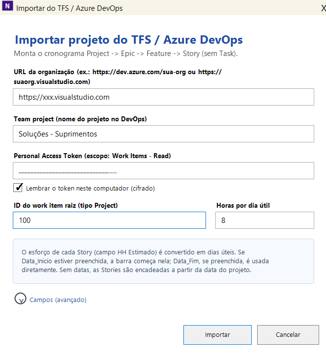
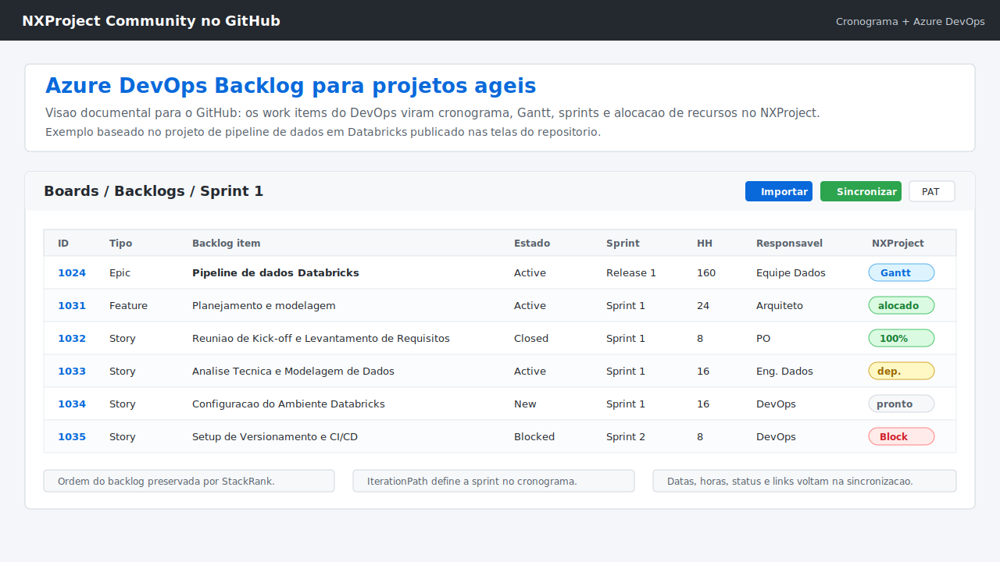

🌐 **Português** | [Read in English](README.md)

---

# NXProject Community

**Visibilidade gerencial sobre o Azure DevOps — sem mudar nada no fluxo da equipe técnica.**

O NXProject permite que Líderes Técnicos, Scrum Masters, Gerentes de Projeto e Gestores de Negócio enxerguem o cenário real do projeto a partir do Azure DevOps: cronograma, dependências, alocação de pessoas e Gantt — em um aplicativo desktop gratuito para Windows.

A equipe técnica continua trabalhando no Azure DevOps exatamente como antes: rastreabilidade de código, pull requests, pipelines e qualidade de entrega intactos. O NXProject lê esses dados e transforma o backlog em uma visão de planejamento que gestores e líderes conseguem usar para tomar decisões.

---

## O problema que o NXProject resolve

Projetos de TI que usam Azure DevOps têm o backlog organizado, sprints definidas e work items atualizados — mas **a gestão não tem uma visão de cronograma integrada**. Perguntas simples ficam sem resposta rápida:

- Quando essa Feature vai terminar, considerando todas as Stories?
- Qual recurso está sobrecarregado no próximo mês?
- Se essa Story atrasar, o que mais é impactado?
- O projeto vai entregar no prazo?

O NXProject importa a hierarquia do Azure DevOps e transforma esses dados em um cronograma gerenciável, com Gantt, dependências, alocação e alertas de atraso — **sem que a equipe técnica precise mudar nada no seu processo**.

---

## Cada perfil vê o que precisa, sem atrito

A equipe de desenvolvimento segue usando o Azure DevOps como fonte da verdade: commits vinculados, code review, automação de pipeline e rastreabilidade completa permanecem inalterados. O NXProject é uma **camada de leitura e planejamento** sobre esses dados, voltada para quem precisa responder perguntas de prazo, capacidade e risco.

---

## A motivação por trás do NXProject

O NXProject não nasceu como um produto. Nasceu para resolver um problema real.

Na época, minha esposa estava cursando mestrado em Gestão da Educação e precisava elaborar o cronograma de um projeto relacionado à reforma de uma rampa em uma escola. A necessidade parecia simples: organizar atividades, dependências e acompanhar o planejamento de forma visual.

Procuramos ferramentas gratuitas para isso, mas as opções open source que encontramos estavam desatualizadas e as alternativas comerciais exigiam licenças que eu não tinha naquele momento — eu estava em transição entre empresas.

Então, em um fim de semana, decidi criar uma alternativa simples para transformar tarefas em um cronograma visual e facilitar o acompanhamento do projeto.

O objetivo inicial era apenas resolver aquele problema.

Mas durante o desenvolvimento percebi que o desafio era muito maior.

Depois de mais de 20 anos atuando com liderança técnica em dados e engenharia de software, percebi que o mesmo conflito aparecia repetidamente em projetos de tecnologia: ferramentas técnicas funcionavam muito bem para equipes de desenvolvimento e engenharia de dados, enquanto ferramentas de gestão entregavam cronogramas e relatórios — mas frequentemente à custa de processos paralelos, retrabalho e perda de rastreabilidade.

Equipes técnicas precisavam continuar trabalhando nas ferramentas do dia a dia.

Gestores precisavam entender prazo, capacidade, dependências e riscos.

Normalmente alguém precisava abrir mão de alguma coisa.

Foi quando o projeto deixou de ser apenas um gerador de cronogramas e evoluiu para o NXProject.

Meses depois, com o amadurecimento da ideia e o avanço das ferramentas modernas de desenvolvimento assistido por IA, após aprofundar o uso de ambientes como Codex e Claude Code, o produto evoluiu rapidamente. O que começou como um protótipo simples ganhou novas capacidades de planejamento, visualização e integração, permitindo acelerar a construção da visão que existia desde o início.

Mais tarde, ao integrar com Azure DevOps, percebi que o mesmo conceito também ajudava equipes reais de engenharia de software e engenharia de dados: os times continuavam trabalhando no fluxo já estabelecido — backlog, código, pipelines, automações e rastreabilidade — enquanto líderes e gestores finalmente ganhavam uma visão integrada de cronograma, dependências, capacidade e impacto.

Hoje o NXProject transforma dados do Azure DevOps em uma visão gerencial de planejamento e execução, permitindo que técnico e gestão trabalhem juntos — sem atrito, sem processos paralelos e sem abrir mão da rastreabilidade.

---

## Download

- [Baixar ZIP do NXProject Community com `.exe` e DLLs](../../releases/latest/download/NXProject.Community-Release.zip)
- [Ver notas da versão e downloads do código-fonte](../../releases/latest)

**Não precisa instalar nada.** Extraia o ZIP e execute o `NXProject.Community.exe` — o runtime do .NET já vem embutido.

> O binário foi gerado em ambiente com antivírus McAfee. Se preferir compilar você mesmo, veja as instruções abaixo.
>
> Nota para publicação: o `.exe` oficial do NXProject Community deve ser gerado com `dotnet publish --self-contained true`, para que o pacote de release inclua o runtime do .NET e execute direto pelo `NXProject.Community.exe`.
> Se o pacote for gerado apenas com `dotnet build`, o Windows pode exibir uma mensagem enganosa de .NET corrompido, instalação quebrada ou runtime ausente.

---

## Se o Windows bloquear o .exe

O Windows pode recusar a abertura do `NXProject.Community.exe` com a tela azul do SmartScreen ("O Windows protegeu seu computador") ou simplesmente não fazer nada ao clicar duas vezes. Isso acontece porque o binário não é assinado digitalmente e foi baixado da internet.

### Opção 1 — Desbloquear via Propriedades (mais simples, não precisa de administrador)

1. Clique com o botão direito em `NXProject.Community.exe` → **Propriedades**
2. Na aba **Geral**, marque a caixa **Desbloquear** (parte inferior)
3. Clique em **OK** e abra o `.exe` novamente

Se a caixa não aparecer, o arquivo já está desbloqueado (ou seu sistema tem uma política mais restritiva — veja as opções abaixo).

### Opção 2 — Assinar com certificado de desenvolvedor local (recomendado para organizações)

Execute o script abaixo **como Administrador** uma vez. Ele cria um certificado autoassinado de code signing, instala como publisher confiável na máquina e assina todos os `.exe`/`.dll` do build:

```powershell
# Executar como Administrador na raiz do projeto
.\sign-nxproject.ps1
```

Depois disso, rode normalmente com `.\run-community.ps1` ou clicando duas vezes no `.exe`. **Não é necessário passar nenhum parâmetro** — o certificado fica instalado no store da máquina e o Windows o reconhece automaticamente.

> O certificado tem validade de 10 anos e cobre builds futuros — basta re-executar `sign-nxproject.ps1` após cada nova versão.

### Opção 3 — Política WDAC suplementar (para ambientes corporativos com controle de execução rígido)

Se sua organização usa Windows Defender Application Control (WDAC) e as opções acima não resolvem, execute o script WDAC como Administrador para liberar a pasta do NXProject:

```powershell
# Executar como Administrador
.\allow-nxproject-wdac.ps1
```

Isso cria uma política WDAC suplementar que permite executáveis da pasta do NXProject. Pode ser necessário reiniciar o computador.

> Esta opção só é necessária em ambientes corporativos com controle de execução rígido. A maioria dos usuários resolve com a Opção 1 ou 2.

---

## Capturas de tela





---

## Para quem é o NXProject

| Perfil | O que o NXProject entrega |
|---|---|
| **Gerente de Projeto** | Cronograma integrado ao backlog, alertas de atraso, visão de dependências |
| **Scrum Master / RTE** | Capacidade por sprint, conflito de alocação, impacto de mudanças de data |
| **Tech Lead** | Visão de Features e Stories com predecessoras e estimativas em horas |
| **PMO** | Consolidação de múltiplos projetos, exportação para MS Project / Excel |

---

## Integração com Azure DevOps

### Do backlog ao cronograma em minutos

O NXProject importa a hierarquia completa do seu projeto diretamente do Azure DevOps:

```
Project → Epic → Feature → Story
```

Cada Story vira uma linha do cronograma com data de início, duração calculada em dias úteis, responsável e sprint — tudo extraído dos campos que seu time já preenche no DevOps.

### Lista de Projetos DevOps

Gerencie múltiplos projetos DevOps em um arquivo compartilhado entre toda a equipe. Cada projeto tem nome e ID raiz; ao importar, basta selecionar o projeto da lista, sem precisar lembrar o ID manualmente.

### O que é lido automaticamente

- **Hierarquia**: `Project → Epic → Feature → Story` via links `Child`
- **Estimativas**: campo `HH Estimado` → duração em dias úteis no calendário do projeto
- **Datas**: `Data_Inicio` e `Data_Fim` quando já definidas no DevOps
- **Responsável**: `System.AssignedTo` → recurso do projeto
- **Sprint**: `System.IterationPath` → associação com sprints do NXProject
- **Ordem do backlog**: `Microsoft.VSTS.Common.StackRank`
- **Bloqueios**: Tasks filhas com tag `Block` marcam a Story como bloqueada
- **Estado**: Stories `Closed`/`Resolved` com Tasks filhas ainda em aberto são sinalizadas e corrigidas automaticamente
- **% de Alocação**: `Perc_Alocação` — percentual do dia da pessoa dedicado a esta Story (afeta a data fim calculada)
- **Controle de versão**: `Sync_version` e `Sync_Name` — controle de concorrência entre múltiplos usuários (veja abaixo)

> Os nomes dos campos podem ser alterados no expansor **Campos (avançado)** da tela de importação, caso o seu processo use nomes diferentes.

---

### Campos customizados obrigatórios (Story, Feature e Epic)

O NXProject lê e grava campos customizados em **Stories, Features e Epics** do Azure DevOps. É necessário criá-los no template de processo em **Configurações da Organização → Processo → [Seu Processo]** e adicioná-los a cada tipo de work item que você quer sincronizar (Story, Feature, Epic).

| Nome do campo (exibição) | Nome de referência | Tipo | Padrão no NXProject | Usado em | Finalidade |
|---|---|---|---|---|---|
| `HH Estimado` | `Custom.HHEstimado` *(exemplo)* | Inteiro ou Decimal | `HH Estimado` | Story, Feature, Epic | Esforço estimado em horas |
| `Data_Inicio` | `Custom.DataInicio` *(exemplo)* | Data/Hora | `Data_Inicio` | Story, Feature, Epic | Data de início planejada |
| `Data_Fim` | `Custom.DataFim` *(exemplo)* | Data/Hora | `Data_Fim` | Story, Feature, Epic | Data de fim planejada |
| `Perc_Alocação` | `Custom.PercAlocacao` *(exemplo)* | Inteiro (1–100) | `Perc_Alocação` | Story | % do dia da pessoa dedicado a esta Story |
| `Perc_Conclusao` | `Custom.PercConclusao` *(exemplo)* | Inteiro (0–100) | `Perc_Conclusao` | Story | % de conclusão (lido no import, gravado no sync) |
| `Sync_version` | `Custom.Syncversion` *(exemplo)* | Inteiro | `Sync_version` | Story, Feature, Epic | Contador de versão de concorrência (gerenciado automaticamente) |
| `Sync_Name` | `Custom.SyncName` *(exemplo)* | Texto *(texto simples, não Identity)* | `Sync_Name` | Story, Feature, Epic | Quem realizou a última sincronização (gerenciado automaticamente) |

> Os nomes de referência acima são exemplos — o Azure DevOps os gera automaticamente a partir do nome de exibição e do prefixo da sua organização.  
> Se os seus campos tiverem nomes de exibição diferentes, ajuste-os no NXProject em **Arquivo → Importar TFS / Azure DevOps → expansor "Campos (avançado)"**.

> **Dica:** crie os campos uma vez no nível do processo e adicione-os a Story, Feature e Epic — todos os tipos compartilham a mesma definição de campo.

#### Controle de concorrência (`Sync_version` / `Sync_Name`)

Quando dois usuários sincronizam alterações simultaneamente, a última gravação poderia sobrescrever a primeira. O NXProject evita isso com o par `Sync_version` / `Sync_Name`, que deve existir em todos os tipos de work item sincronizados (Story, Feature e Epic):

- A cada sincronização que grava ao menos uma alteração real, `Sync_version` é incrementado em 1 e `Sync_Name` recebe o usuário Windows atual.
- Ao sincronizar, o NXProject compara a versão que leu no import com a versão atual no DevOps. Se a versão do DevOps for maior, outro usuário gravou mais recentemente — o item é **ignorado** e marcado em **vermelho** no cronograma.
- Itens vermelhos permanecem destacados até que você reimporte o projeto. O log de sincronização mostra quais itens tiveram conflito.
- Ao clicar em um item vermelho na coluna de estado, a janela de vínculo DevOps exibe um aviso de conflito com o botão **↓ Reimportar** para iniciar o import diretamente.
- O contador de versão reinicia em 1 ao atingir o limite inteiro.

> **`Sync_Name` deve ser do tipo texto simples, não Identity.** Se foi criado como campo Identity (seletor de pessoa), exclua e recrie como **Texto (linha única)**.

### Log de importação

Ao importar, o NXProject gera um relatório com:
- Stories cujo estado foi corrigido automaticamente (ex: Story fechada com Task em aberto)
- Predecessoras que apontam para itens fora do escopo importado
- Avisos e inconsistências para revisão antes de publicar o cronograma

### Sincronização de volta ao DevOps

Após ajustar datas, dependências e estimativas no cronograma, o NXProject sincroniza as alterações de volta para o Azure DevOps: título, descrição, horas, datas, estado, tags, sprint e links de predecessora.

### Abrir work item direto no DevOps

Em qualquer tarefa vinculada, o botão **"Abrir no DevOps ↗"** abre o work item no browser. A janela de vínculo também exibe a lista de Tasks filhas com ID, nome e estado — para referência rápida sem sair do NXProject.

---

## Usabilidade

- **Gráfico de Gantt** interativo com zoom por dia, sprint ou período
- **Dependências entre tarefas** (predecessoras), inclusive entre Stories de Epics diferentes
- **Alocação de recursos**: visão de carga por pessoa e período
- **Health Check do Projeto**: lista tarefas atrasadas e sem responsável
- **Calendário configurável**: feriados, dias úteis, horas por dia
- **Exportação**: MS Project XML, OpenProj, Excel XML, CSV, **PDF (paisagem)**
- **Assistente IA** para sugestão de estrutura de tarefas
- **Janela Tech Lead**: busca, cria e edita Tasks DevOps por Story; seleção em cascata Epic → Feature → Story pela toolbar, ou abertura direta pelo menu de contexto da Story
- **Coluna TKs** (modo expandido): exibe a contagem de Tasks filhas de cada Story no Azure DevOps — vermelho quando zero, para identificar Stories sem Tasks técnicas criadas
- **Campos Custom DevOps**: campos de classificação configuráveis por tipo de work item (Epic, Feature, Story); valores lidos na importação e editáveis via menu de contexto
- **Duplo clique para editar** o nome da atividade, evitando alterações acidentais ao navegar na grade
- **Multilíngue**: Português (Brasil) e Inglês, detectado automaticamente pelo Windows e alternável nas Configurações

---

## Compilar a partir do código-fonte

Pré-requisitos: [.NET 10 SDK](https://dotnet.microsoft.com/en-us/download/dotnet/10.0) e [VS Code](https://code.visualstudio.com/download).

```powershell
# Preparar ambiente
.\setup-community-vscode.ps1

# Compilar
.\build-community.ps1 -Configuration Release

# Ou gerar o zip de distribuição self-contained
.\release-community-new-version.ps1 -Configuration Release
```

O executável de desenvolvimento será gerado em `NXProject.Community\bin\Release\net10.0-windows\`.

> **Importante — gerar o `.exe` oficial de release**
>
> Use sempre `dotnet publish --self-contained true -r win-x64` (ou o script de release do projeto, que já faz isso automaticamente).
> Se usar apenas `dotnet build`, o `.exe` gerado pode falhar em máquinas com o registro do .NET corrompido ou incompleto, exibindo uma mensagem enganosa como:
>
> ```
> To run this application, you must install .NET.
> ```
>
> …mesmo que `dotnet --list-runtimes` mostre o .NET instalado corretamente.
> O pacote self-contained inclui o runtime do .NET dentro do ZIP e elimina esse problema.

---

## Configurar o Azure DevOps

### Personal Access Token

1. No Azure DevOps, clique no ícone de usuário → **Personal access tokens**
2. Clique em **New Token**
3. Em **Scopes**, selecione **Work Items → Read** (adicione **Write** se quiser sincronizar de volta)
4. Copie o token e cole no campo correspondente na tela de importação do NXProject

O token pode ser salvo localmente cifrado com as credenciais do Windows (DPAPI).

### Campos personalizados

Se o seu processo usa nomes de campo diferentes de `HH Estimado`, `Data_Inicio` ou `Data_Fim`, esses nomes podem ser ajustados na área **Campos (avançado)** da janela de importação.

### Calendário de trabalho

Configure feriados, horas úteis por dia e dias da semana em **Exibir → Calendário...**  
O padrão é 8 horas por dia, segunda a sexta.

---

## Licença e contato

- **Empresa**: Nexus XData Tecnologia Ltda
- **Contato comercial**: `comercial.nexus.xdata@gmail.com`

O NXProject usa modelo **Open Core / licenciamento dual**:

| Edição | Uso |
|---|---|
| **Community (gratuita)** | Uso livre para pessoas físicas e empresas, inclusive uso comercial interno, sem limite de usuários. Redistribuição gratuita permitida mantendo o crédito à Nexus XData. |
| **Comercial / Enterprise** | Sem restrições de revenda ou SaaS, suporte oficial, SLA, módulos exclusivos (impressão/PDF, calendário avançado, integrações com IA). Contate-nos para proposta. |

> Vender, cobrar ou oferecer o NXProject como serviço pago exige licença comercial.

---

## Conte como o NXProject está ajudando o seu projeto

Se o NXProject está sendo usado na sua empresa e está fazendo diferença — seja na visibilidade do cronograma, na gestão de equipe ou na integração com o Azure DevOps — **queremos saber**.

Envie um relato curto para `comercial.nexus.xdata@gmail.com` contando:

- O contexto do projeto (tamanho da equipe, segmento, desafio que tinha)
- O que melhorou depois que passou a usar o NXProject
- Se autoriza, divulgamos o caso como referência para a comunidade

Relatos reais ajudam a priorizar melhorias, atraem novos colaboradores e mostram para outras equipes que o produto funciona na prática. **Sua experiência pode ajudar outros projetos.**
